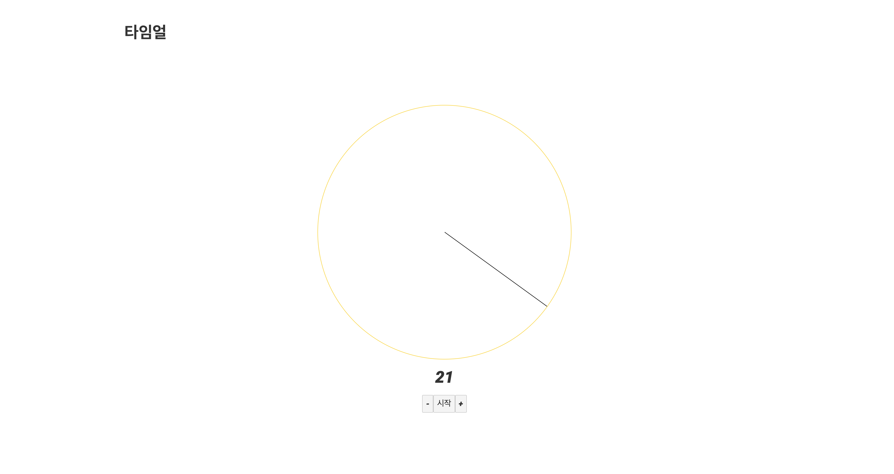

# 스벨트 이그잼플 그 두번째, 타임얼

- <code>+</code> 버튼 누르면 시간이 1초씩 증가하고 아날로그 타이머도 비율에 맞게 move
- <code>-</code> 버튼 누르면 시간이 1초씩 감소하고 아날로그 타이머도 비율에 맞게 move
- <code>시작</code> 버튼 누르면 모든 버튼이 비활성화됨 and 시간이 1초씩 감소하고, 아날로그 타이머도 비율에 맞게 move
- 시간이 <code>0</code>이 되면 버튼 비활성화가 풀림
- 시간은 <code>0</code> 이상 <code>60</code> 미만 일 수 있음
